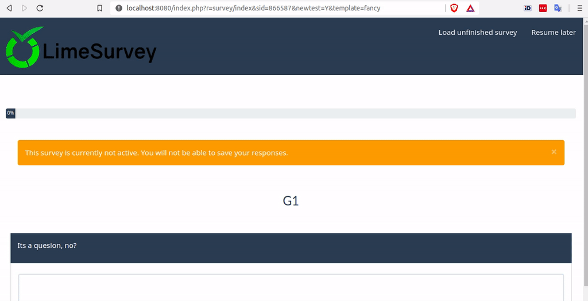
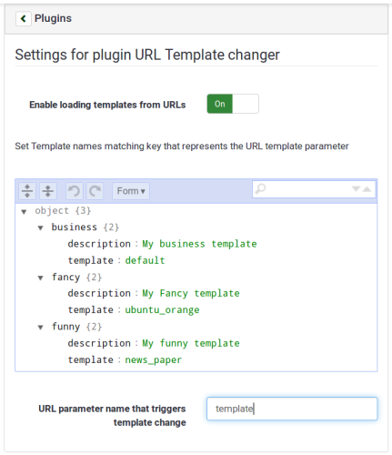

# limesurvey-url-templates

A LimeSurvey plugin to enable overriding survey template for participants via URL paramater.


# Requirements
Requires minimum LimeSurvey version 3.0.1

# Usage
## 1 Install 

### Via console

Change to LS plugins folder:
```
$ cd /your/limesurvey/path/plugins
```
Use git to clone into folder `UrlTemplateChanger`:
```
$ git clone https://github.com/TonisOrmisson/limesurvey-url-templates.git UrlTemplateChanger
```


## 2 Activate plugin

## 3 Set allowed templates & keys in survey settings:
Go to survey plugin settings.

1. Enable loading templates from URLs
2. Set used url parameter values and respective template names as json setting.
3. Set url parameter name that is used to get the template key.


## 4 Use URL parameter to fire the template referred in settings

### Url structure:
* <https://example.com/LimeSurvey/survey/index/sid/{SID}/token/{token}/lang/{lang}/newtest/Y/{templateparam}/{template-key}/>

### Example urls
* <https://example.com/LimeSurvey/survey/index/sid/123456/token/123456790abc/lang/en/newtest/Y/template/business/>
* <https://example.com/LimeSurvey/survey/index/sid/123456/token/123456790abc/lang/en/newtest/Y/template/fancy/>
* <https://example.com/LimeSurvey/survey/index/sid/123456/token/123456790abc/lang/en/newtest/Y/template/funny/>
